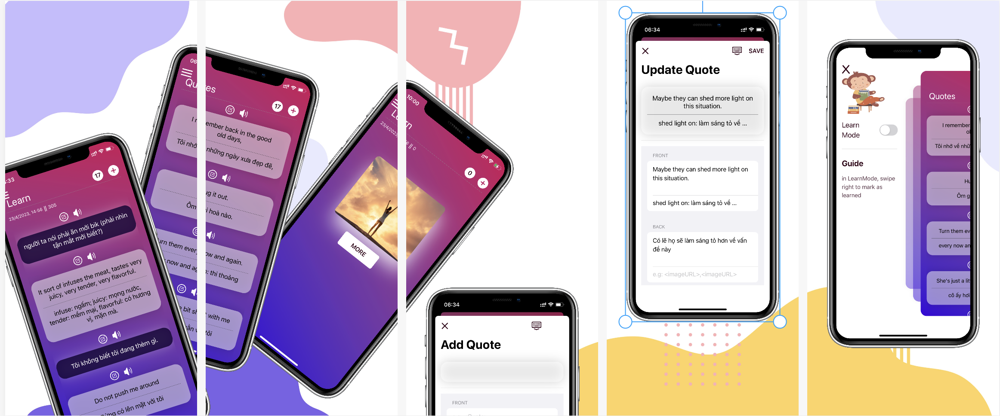
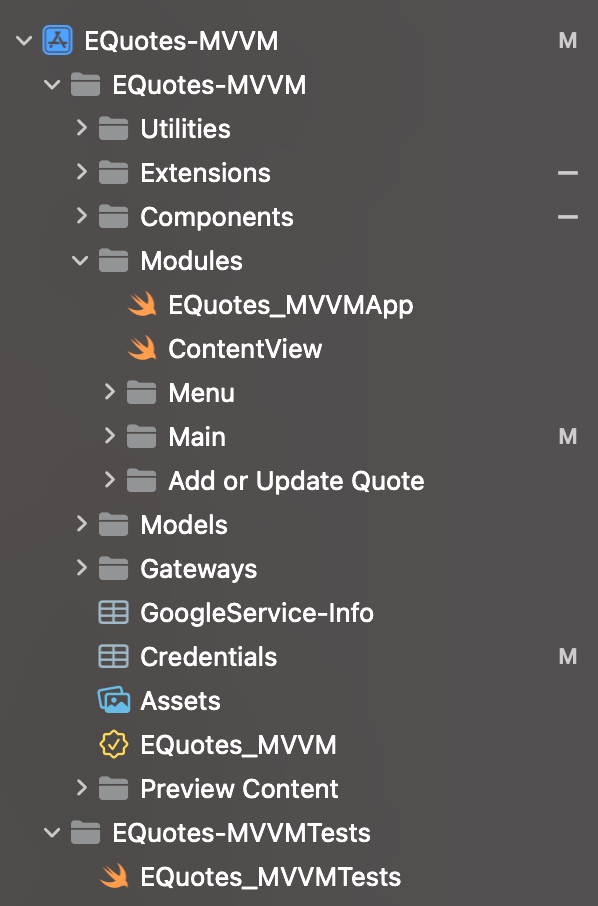
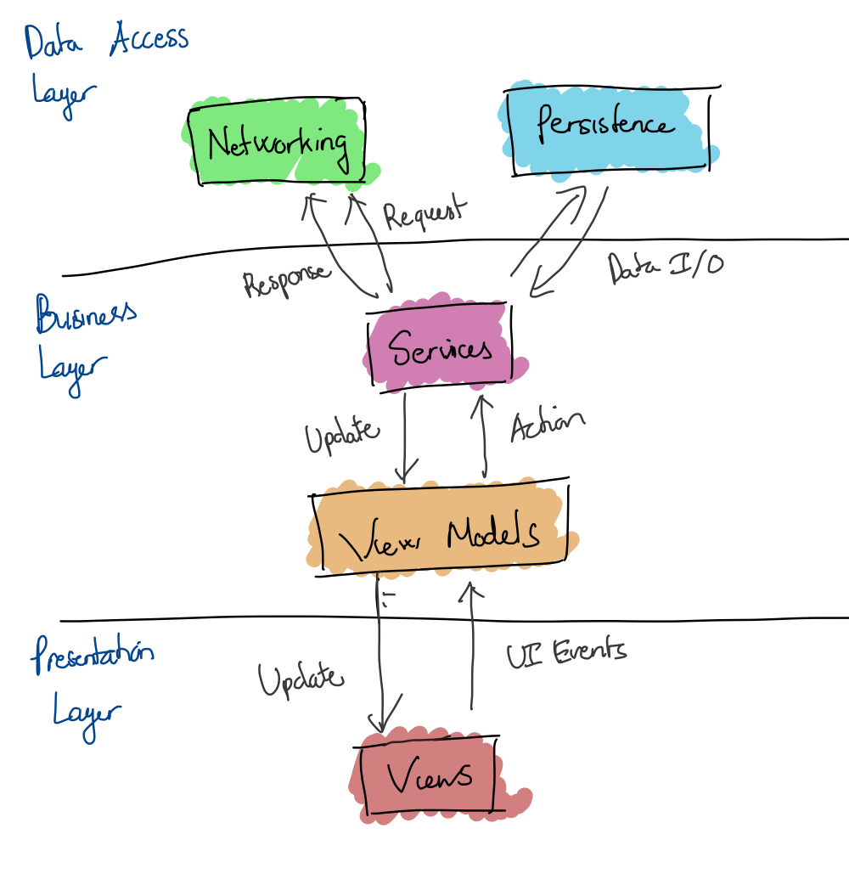
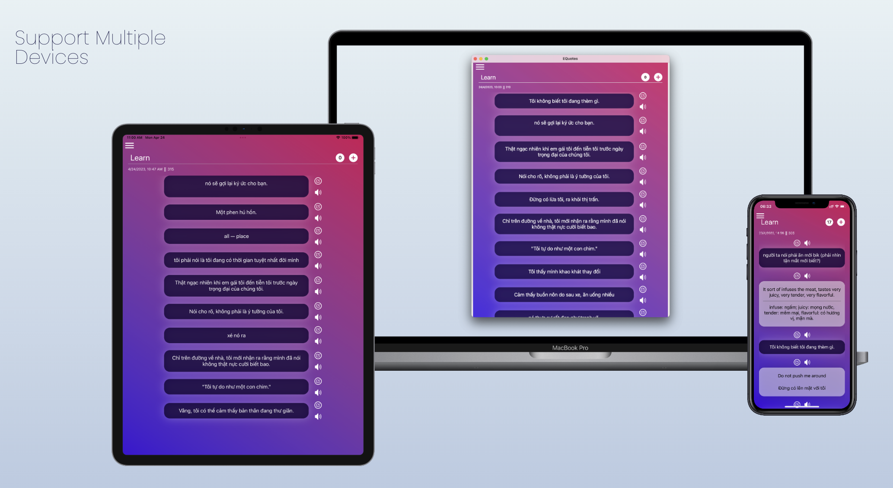

# EQuotes
_Learning English with Quotes_

## About

EQuotes is an application helping to learn English by quotes/sentences.  
 
- _Store_: When we find idioms/sentences which is interesting or useful, save it
- _Learn_: Daily, EQuotes will choose randomly 5 phrases to remind you to learn this phrase by repetition & recall method.

## Key Features
- App Structure

-
- MVVM Design Pattern - Decoupled **Presentation**, **Business Logic**, and **Data Access layers**.

 Referenced by 
 * [Swift Tutorial: An Introduction to the MVVM Design Pattern](https://adevait.com/ios/swift-tutorial-mvvm-design-pattern)  
 * [Build SwiftUI App with MVVM, Core Data, Combine, and API requests | SwiftUI Crypto App](https://www.youtube.com/watch?v=TTYKL6CfbSs&list=PLwvDm4Vfkdphbc3bgy_LpLRQ9DDfFGcFu)
- Realtime Database using **Firebase**
- Request remote API: Google Translate API
- **SwiftUI** + **Combine** implementation

## Getting Started

1. Clone the repo
2. Add _GoogleService-Info.plist_ into the project
3. Run the app
